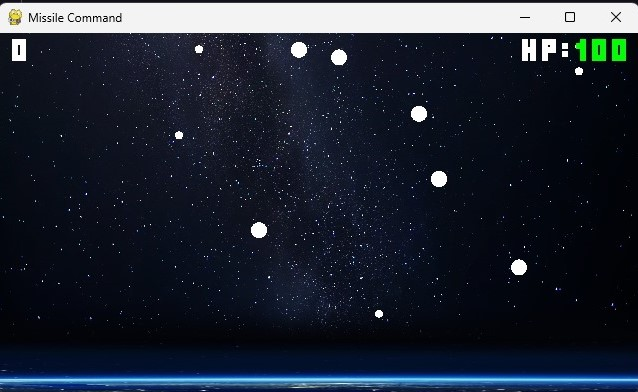
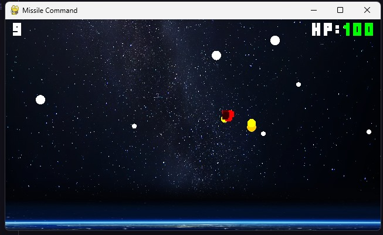
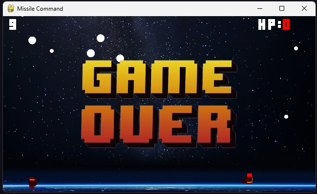

# missile-command

## Introdução
Jogo desenvolvido para a Disciplina de Computação Gráfica, fizemos uma cópia do jogo missile-command um jogo lançado em 1980 pela Atari.

## Dependences
-Pillow
-Pygames
-OpenGL
-Numpy
