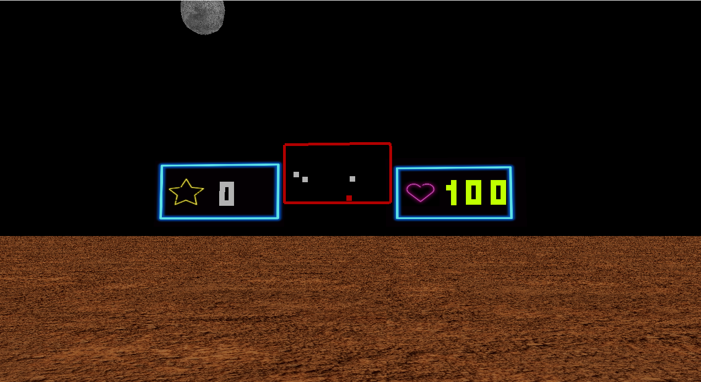

# missile-command

## Introdução
Jogo desenvolvido para a Disciplina de Computação Gráfica, fizemos uma cópia do jogo missile-command um jogo lançado em 1980 pela Atari.

## Como instalar
### Com pip:
na pasta do projeto execute via terminal: pip freeze > requirements.txt

rode o projeto da forma que preferir ou com: python run.py

### Com poetry:
na pasta do projeto execute no terminal: pip install poetry

e depois: poetry install

aguarde as instalações e depois é só rodar: poetry run python run.py

### Com makefile(requer makefile pré-instalado):
na pasta do projeto execute via terminal: make install

e depois para executar: make run
